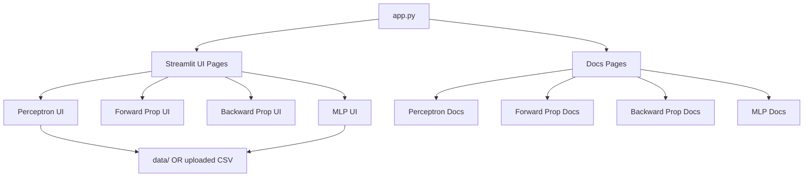
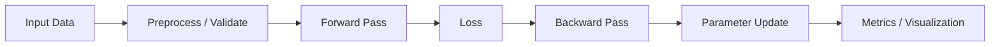

# Neural Network Toolbox


An interactive Streamlit app for learning core neural network concepts by building them from scratch. The app includes hands-on modules for perceptron, forward propagation, backward propagation, and a multi-layer perceptron (MLP) with visualizations and dataset support.

## Highlights

- Interactive, educational UI built with Streamlit
- Perceptron training with logic gates or custom CSV
- Forward and backward propagation walkthroughs
- MLP classifier with binary and multiclass support
- Built-in sample datasets (AND, IRIS)

## Project Structure

```
.
├─ app.py
├─ requirements.txt
├─ data/
│  ├─ AND.csv
│  └─ IRIS.csv
└─ src/
   ├─ assets/
   │  └─ documnets/
   │     ├─ back_propagation.py
   │     ├─ forward_propagation.py
   │     ├─ mnp.py
   │     └─ perceptron.py
   ├─ core/
   │  └─ perceptron.py
   └─ ui/
      ├─ backward_propagation.py
      ├─ forward_propagation.py
      ├─ mlp.py
      └─ perceptron_ui.py
```

## Architecture Overview



## Module Flow



## Requirements

- Python 3.9+
- Packages listed in [requirements.txt](requirements.txt)

## Quick Start

1. Create and activate a virtual environment
2. Install dependencies
3. Run the Streamlit app

```bash
python -m venv .venv
. .venv/Scripts/activate
pip install -r requirements.txt
streamlit run app.py
```

## Usage

- Use the sidebar to choose a module or open documentation pages.
- For Perceptron and MLP modules, select a logic gate or upload a CSV file.
- Configure parameters and run training to visualize results.

## Data Input Rules

- Perceptron module expects exactly two binary feature columns and a binary target.
- MLP module supports binary or multiclass targets and handles numeric and categorical features.
- Large datasets are rejected to keep performance stable in the UI.

## Notes

- This project is educational and focuses on explainability over performance.
- The MLP module includes basic preprocessing (standardization and one-hot encoding).

## License

MIT License - free to use, modify, and share for learning and beyond.
